# SYSTEM USE CASES - DETAILED REPORT
**Project:** Mental Health Support System (Major)
**Date:** 15/12/2025
**Version:** 4.0 (Final Comprehensive)

This document provides a comprehensive specification of system actors and use cases, based on a complete code analysis.

---

## 1. Actors Definition

| Actor | Role Key | Description |
|:---|:---|:---|
| **Patient (User)** | `user` | An individual complying with system registration who seeks mental health support, uses AI features, books consultations, tracks exercises, and manages their profile. |
| **Doctor** | `doctor` | A verified mental health professional who manages their schedule/availability, conducts video consultations, records patient clinical notes, and creates psychological tests. |
| **Admin** | `admin` | A super-user responsible for system oversight, user/doctor management, subscription plan configuration, AI model selection, and platform analytics. |
| **AI System** | `system` | An automated agent (LLM) providing 24/7 empathetic conversational support and real-time sentiment analysis. |

---

## 2. Use Case Diagrams (Mermaid)

```mermaid
graph TD
    User((Patient))
    Doc((Doctor))
    Adm((Admin))
    AI((AI System))

    subgraph "Core Functionality"
        UC1[Register/Login]
        UC2[Manage Profile]
        UC3[AI Chat Support]
        UC4[Emotion Analysis]
        UC5[Search Doctor]
        UC6[Book Appointment]
        UC7[Make Payment]
        UC8[Video Call]
        UC14[Track Exercises]
        UC15[Manage Alerts]
    end

    subgraph "Doctor Portal"
        UC9[Manage Schedule & Time Off]
        UC10[View Patient Records]
        UC11[Write Clinical Notes]
        UC16[Create Psych Tests]
    end

    subgraph "Admin Portal"
        UC12[Manage Users/Doctors]
        UC13[Configure Plans]
        UC17[Manage AI Models]
        UC18[View Analytics]
    end

    User --> UC1
    User --> UC2
    User --> UC3
    User --> UC4
    User --> UC5
    User --> UC6
    User --> UC7
    User --> UC8
    User --> UC14
    User --> UC15

    Doc --> UC1
    Doc --> UC8
    Doc --> UC9
    Doc --> UC10
    Doc --> UC11
    Doc --> UC16

    Adm --> UC1
    Adm --> UC12
    Adm --> UC13
    Adm --> UC17
    Adm --> UC18

    UC3 -.-> AI
    UC4 -.-> AI
```

---

## 3. Detailed Use Case Specifications

### 3.1 Authentication & Profile

| ID | **UC-01: User Login** |
|:---|:---|
| **Actor** | All Users |
| **Goal** | Authenticate identity to access protected features. |
| **Main Flow** | 1. User enters Email and Password. 2. System validates format and credentials. 3. System generates JWT Token via `auth_routes`. 4. System redirects to role-specific Dashboard. |
| **Alt. Flow** | **Invalid Credentials**: Show error. **Banned Account**: Access denied. |

| ID | **UC-02: Register Account** |
|:---|:---|
| **Actor** | Patient |
| **Goal** | Create a new profile. |
| **Main Flow** | 1. User enters Name, Email, Password. 2. System validates uniqueness. 3. System creates DB record. 4. System auto-logs user in. |

### 3.2 Patient Modules - Mental Health

| ID | **UC-03: Chat with AI** |
|:---|:---|
| **Actor** | Patient |
| **Goal** | Receive emotional support. |
| **Main Flow** | 1. Patient sends message via `/api/chat/send`. 2. AI analyzes sentiment. 3. AI responds. 4. System displays response. 5. Patient helps improve AI by submitting feedback (Rating 1-5). |
| **Alt. Flow** | **Archive Chat**: Patient archives old session to hide it. |

| ID | **UC-04: View Emotion Insights** |
|:---|:---|
| **Actor** | Patient |
| **Goal** | Track emotional trends. |
| **Main Flow** | 1. Patient views "Emotion Dashboard". 2. System aggregates logs via `/api/emotion/insights`. 3. System displays "Dominant Emotion", "Risk Level", and "Sentiment Trend". |

| ID | **UC-14: Track Exercises** |
|:---|:---|
| **Actor** | Patient |
| **Goal** | Perform CBT/Wellness exercises. |
| **Main Flow** | 1. Patient selects exercise (e.g., "Breathing"). 2. clicks "Start". 3. System tracks time. 4. Patient clicks "Complete". 5. System updates "Progress" and "Streak" via `/api/exercise`. |

| ID | **UC-15: Manage Alerts** |
|:---|:---|
| **Actor** | Patient |
| **Goal** | View and dismiss system notifications. |
| **Main Flow** | 1. Patient views Alert Center. 2. Filters by "Critical" or "Active". 3. Marks alert as "Dismissed". |

### 3.3 Patient Modules - Booking & Payment

| ID | **UC-06: Process Payment** |
|:---|:---|
| **Actor** | Patient |
| **Goal** | Pay for services. |
| **Main Flow** | 1. Patient selects Gateway (VNPay/MoMo). 2. System generates URL. 3. User pays at Gateway. 4. Webhook confirms payment via `/api/payment/verify`. |

| ID | **UC-05: Book Appointment** |
|:---|:---|
| **Actor** | Patient |
| **Goal** | Schedule consultation. |
| **Main Flow** | 1. Patient searches Doctor. 2. Checks availability (`/api/reviews/doctor/{id}/slots`). 3. Books slot. |

| ID | **UC-19: Submit Doctor Review** |
|:---|:---|
| **Actor** | Patient |
| **Goal** | Rate doctor performance. |
| **Main Flow** | 1. After appointment, Patient rates (1-5 stars). 2. Adds specific ratings for "Professionalism" & "Communication". 3. System saves review. |

### 3.4 Doctor Modules

| ID | **UC-09: Manage Schedule & Time Off** |
|:---|:---|
| **Actor** | Doctor |
| **Goal** | Set availability. |
| **Main Flow** | 1. Doctor sets weekly schedule. 2. Doctor adds "Time Off" block via `/api/reviews/doctor/{id}/time-off`. 3. System blocks bookings during these times. |

| ID | **UC-10: Manage Patient Records** |
|:---|:---|
| **Actor** | Doctor |
| **Goal** | Maintain medical history. |
| **Main Flow** | 1. Doctor views Patient List. 2. Creates new Record (Diagnosis, Medications). 3. Updates existing records. |

| ID | **UC-16: Create Psychological Tests** |
|:---|:---|
| **Actor** | Doctor |
| **Goal** | Assign assessments. |
| **Main Flow** | 1. Doctor creates new Test (e.g., "Beck Depression"). 2. Adds Questions. 3. Assigns to Patient. 4. Patient submits responses. |

### 3.5 Admin Modules

| ID | **UC-12: Manage Users (CRUD)** |
|:---|:---|
| **Actor** | Admin |
| **Goal** | Moderate user base. |
| **Main Flow** | 1. Admin views Users. 2. Deactivates/Edits users via `/api/admin/users`. |

| ID | **UC-13: Manage Plans** |
|:---|:---|
| **Actor** | Admin |
| **Goal** | Configure pricing. |
| **Main Flow** | 1. Admin creates Plan (Price, Limits). 2. Activates/Deactivates plans. |

| ID | **UC-17: Manage AI Models** |
|:---|:---|
| **Actor** | Admin |
| **Goal** | Configure AI backend. |
| **Main Flow** | 1. Admin adds Model Config (Provider, Version). 2. Sets default model. |

| ID | **UC-18: View Analytics** |
|:---|:---|
| **Actor** | Admin |
| **Goal** | Monitor business health. |
| **Main Flow** | 1. View Dashboard. 2. Check Revenue, User Growth, Alert Stats. |

---

## 4. Non-Functional Requirements

1.  **Security**: Role-Based Access Control (RBAC) enforced on all routes. Patient records accessible only by assigned doctors.
2.  **Performance**: Exercises and Chat responses cached where appropriate.
3.  **Reliability**: WebRTC for video calls, persistent DB for records.
4.  **Compliance**: Emotion logs and medical records are immutable/auditable.

---
**End of Document**
